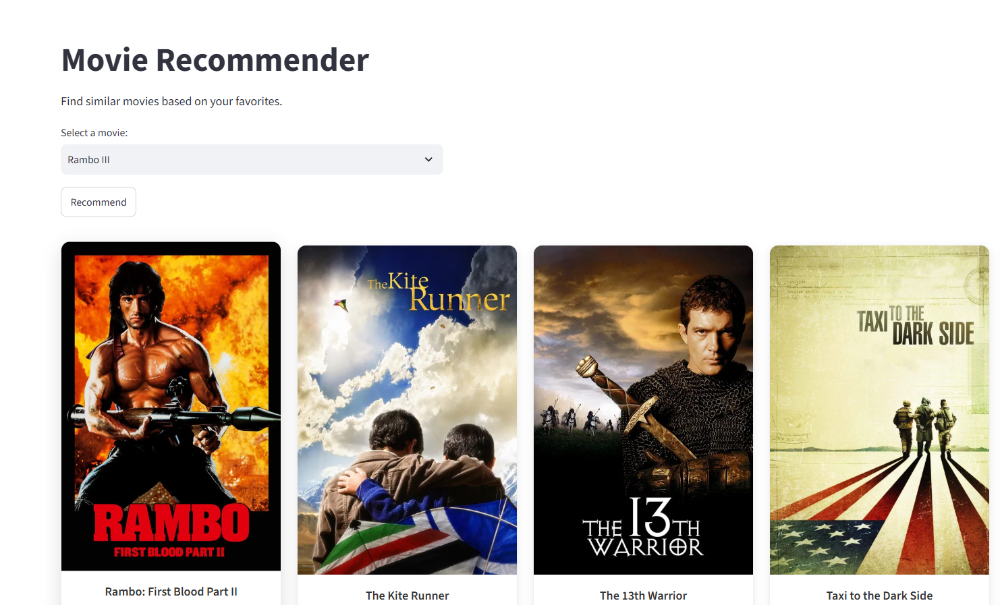

# 🎬 Movie Recommendation System

A modern, elegant web application that recommends movies based on a user's selection. Built using Python, Streamlit, and Machine Learning (Content-Based Filtering), this app suggests 5 similar movies complete with their posters, ratings, cast, director, and YouTube trailers.



## ✨ Features
- **Content-Based Filtering:** Recommends movies similar to the one you choose based on tags like genre, cast, and director.
- **Rich Movie Data:** Fetches real-time movie posters, ratings, cast lists, and directors using the TMDB API.
- **Watch Trailers:** Direct links to YouTube trailers for the recommended movies.
- **Elegant UI:** A sleek, responsive, and modern card-based user interface.

## 🛠️ Tech Stack
- **Frontend / App Framework:** Streamlit, Custom CSS
- **Backend:** Python
- **Machine Learning:** Pandas, Scikit-learn (Cosine Similarity)
- **API Integration:** TMDB (The Movie Database) API

## 🚀 How to Run Locally

### 1. Clone the repository
```bash
git clone https://github.com/PiyushTechie/Movie-Recommendation-System.git
cd Movie-Recommendation-System
```

*(Note: This repository uses Git LFS for large `.pkl` files. Ensure you have [Git LFS](https://git-lfs.com/) installed before cloning.)*

### 2. Install dependencies
Ensure you have Python installed, then run:
```bash
pip install -r requirements.txt
```

### 3. Get your TMDB API Key
This app uses The Movie Database (TMDB) API to fetch movie posters and details.
1. Create an account at [TMDB](https://www.themoviedb.org/).
2. Go to your account settings -> API and request an API key.

### 4. Setup Secrets
Create a `.streamlit` folder in the project root, and inside it create a file named `secrets.toml`:
```toml
TMDB_API_KEY = "your_tmdb_api_key_here"
```

### 5. Run the application
```bash
streamlit run app.py
```

## 🏗️ How it Works
1. **Data Preprocessing:** The recommendation engine is built on the TMDB 5000 Movies & Credits dataset. 
2. **Vectorization:** Text data (genres, keywords, cast, crew) is combined into tags. We use `CountVectorizer` to convert these text tags into numerical vectors.
3. **Cosine Similarity:** We calculate the cosine distance between movie vectors to find the most mathematically similar movies.
4. **Real-time API Calls:** When a movie is selected, the app looks up the 5 closest matches in the pre-calculated similarity matrix, then dynamically pulls their latest posters, trailers, and metadata from the TMDB API.
